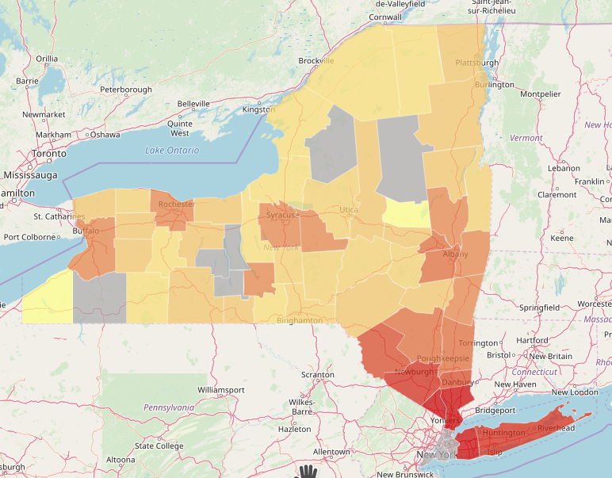

COVID-19 Map by county per capita
===

A map of COVID-19 cases by US county.

## Sources of data

* New York Times
  * https://github.com/nytimes/covid-19-data
  * https://www.nytimes.com/interactive/2020/us/coronavirus-us-cases.html
* US Census Bureau - https://github.com/uscensusbureau/citysdk

 
## Tools

* OpenStreetMap - https://www.openstreetmap.org
* Leaflet

## Demo

Here's New York.  Some counties don't match up.  NYC is described differently between Census and NYT.

## Sites that helped me build this

### Basis

* https://uscensusbureau.github.io/citysdk/examples/leaflet-choropleth/ - sample county choropleth

### Helpers

* https://www.freecodecamp.org/news/how-to-make-a-promise-out-of-a-callback-function-in-javascript-d8ec35d1f981/ - for turning a callback into a promise
* https://leafletjs.com/examples/quick-start/ - a starter
* https://leafletjs.com/examples/geojson/ - for style
* https://developer.mozilla.org/en-US/docs/Web/JavaScript/Reference/Global_Objects/Promise/all
* https://developer.mozilla.org/en-US/docs/Web/API/Streams_API/Using_readable_streams - for streaming fetch() data TODO
* https://www.nytimes.com/article/coronavirus-county-data-us.html?action=click&module=Spotlight&pgtype=Homepage
* https://www.census.gov/data/datasets/time-series/demo/popest/2010s-counties-total.html - for data on county population
* https://observablehq.com/@nickhand/internet-availability-for-us-counties - inspired me
* https://blog.apps.npr.org/2014/09/02/reusable-data-processing.html - server side consideration
